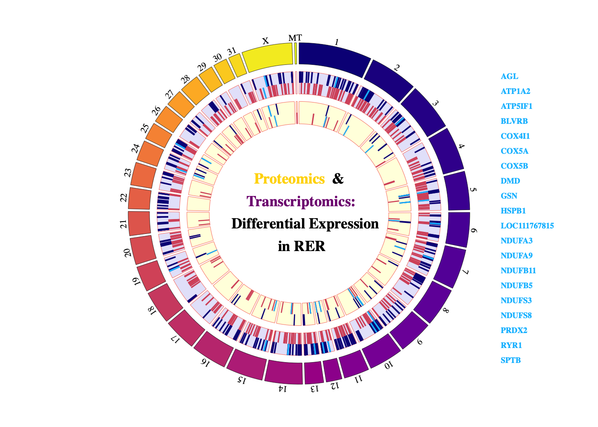

```
Error: <text>:1:10: unexpected symbol
1: function addSvgSaveButtonJquery
             ^
```


### Transcriptomic and Proteomic Assesment of RER in Thoughbred Horses
> Differential expression of genes and proteins identified in horses diagnosed 
> with exertional rhabdomyolysis. 



```
Error: <text>:1:1: unexpected '$'
1: $
    ^
```

> Transcription factor enrichment (TFE) analysis identified the
> heat shock transcription factor 4 (HSF4) enriched among the 
> differentially expressed proteins. HSF4 was found to be differntially 
> expressed in the transcriptome exhibiting a 1.7 fold change increase in 
> horses with RER.


```
Error: <text>:1:1: unexpected '$'
1: $
    ^
```


